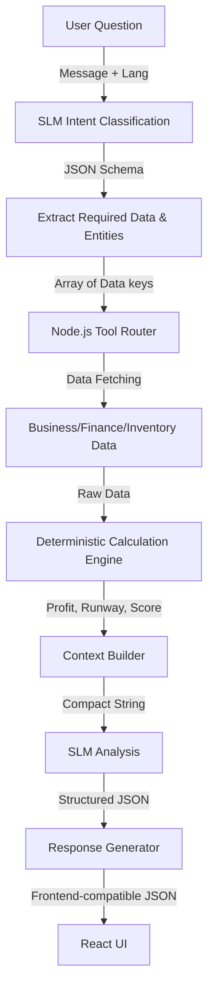

# SLM Intelligence Architecture

## 1. Current Architecture
The Samvaya platform utilizes a hybrid deterministic-AI architecture. Node.js strictly handles all mathematical logic and data retrieval. The Small Language Model (SLM), currently Gemini via native fetch, is solely used for intent classification, business reasoning, and generating localized textual responses. 

### Data Flow Diagram


## 2. Intent Layer
The `IntentService` queries the SLM to parse the raw user query against a fixed taxonomy (e.g., `CASH_FLOW`, `REORDER_DECISION`). It also extracts entities and specifies what backend data categories (e.g., `inventory`, `cashFlow`) are required to answer the query. 

## 3. Tool Routing
The `ToolRouter` receives the `requiredData` array and strictly maps it to allowed deterministic backend methods. It explicitly prevents the SLM from dynamically executing code.

## 4. Context Builder
The `ContextBuilder` aggregates raw data and calculation outputs into a compact JSON string. This avoids passing the entire database to the SLM context window, saving tokens and improving reliability.

## 5. Financial Engines
The `CalculationEngine` runs purely deterministic mathematical logic:
- **Net Profit & Margin**: Derived from revenue and expense totals.
- **Cash Runway**: Calculates months/days remaining based on closing balance and burn rate.
- **Inventory Metrics**: Stockout risks based on current stock vs. daily sales volume.
- **Loan Readiness**: A weighted score evaluating profitability and cash stability.

## 6. Analysis Layer
The `AnalysisService` evaluates the deterministic context via the SLM, reasoning through constraints like cash limits and local market forces. It generates a rigid JSON schema comprising `problem`, `severity`, `insights`, and `recommendations` with assigned priority levels.

## 7. Response Generation
The `ResponseService` converts the detailed SLM analysis into a streamlined JSON payload corresponding perfectly to the existing React UI structure (`recommendation`, `why`, `localEvidence`, `financialImpact`, `nextStep`).

## 8. Error Handling
- Invalid JSON output from the SLM automatically triggers a strictly worded repair prompt (1 retry limit).
- Any failure beyond that reverts to a safe, deterministic fallback response generated by Node.js.
- Missing API keys immediately bypass the SLM without crashing the server.

## 9. Security
- `SLM_API_KEY` exists exclusively in the backend `.env`.
- Tool routing relies on a strict internal whitelist (`switch-case`). The SLM has zero ability to write SQL or spawn processes. 

## 10. Example Output
```json
{
  "recommendation": "Delay purchasing inventory for 7 days.",
  "why": "Your cash runway is critically low (2 days).",
  "localEvidence": "Mandi prices typically drop next week.",
  "financialImpact": "Preserves ₹15,000 working capital.",
  "nextStep": { "label": "View Cash Flow", "route": "/finances" }
}
```
