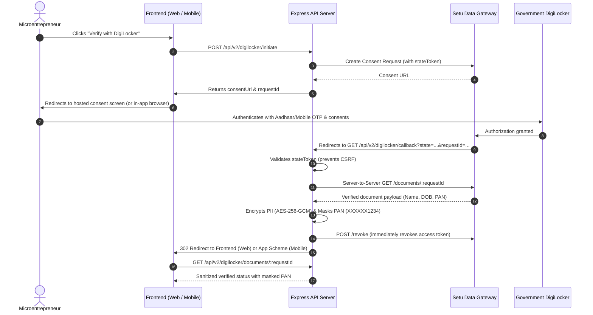

# DigiLocker Document Verification Integration Guide

This guide documents the DigiLocker integration for verified identity (PAN card & government documents) via **Setu (or compatible Data Gateway Aggregator)** for microentrepreneurs using the Samvaya platform.

---

## 1. Overview & Architecture

Instead of navigating the direct government DigiLocker empanelment process, this integration uses an **Aggregator Gateway (Setu)** to provide a compliant, hosted consent workflow.



---

## 2. Environment Variables & Configuration

Add these variables to your `.env` file (reference `.env.example` in `backend/`):

| Variable | Required | Description | Example / Default |
| :--- | :--- | :--- | :--- |
| `DIGILOCKER_ENV` | Yes | `sandbox` for development/testing, `production` for live | `sandbox` |
| `DIGILOCKER_AGGREGATOR_API_KEY` | Yes | API Secret Key from the Aggregator dashboard | `secret_sandbox_...` |
| `DIGILOCKER_CLIENT_ID` | Yes | Client ID assigned to your application | `client_id_...` |
| `DIGILOCKER_CLIENT_SECRET` | Conditional | Aggregator OAuth secret (if applicable) | `client_secret_...` |
| `DIGILOCKER_API_BASE_URL` | Yes | Aggregator Base API URL | `https://dg-sandbox.setu.co` (Sandbox) / `https://dg.setu.co` (Prod) |
| `DIGILOCKER_REDIRECT_URL` | Yes | Callback URL where aggregator redirects post-consent | `http://localhost:5000/api/v2/digilocker/callback` |
| `DIGILOCKER_FRONTEND_SUCCESS_URL`| Yes | Web redirect destination after successful KYC | `http://localhost:5173/business?kyc=success` |
| `DIGILOCKER_FRONTEND_FAILURE_URL`| Yes | Web redirect destination if consent declined or failed | `http://localhost:5173/business?kyc=failed` |
| `DIGILOCKER_MOBILE_REDIRECT_SCHEME`| Yes | Custom URI scheme for mobile in-app browser redirect | `myapp://digilocker-callback` |
| `DIGILOCKER_ENCRYPTION_KEY` | Yes | 32-byte hex key for AES-256-GCM PII encryption at rest | 64-character hex string |

---

## 3. How to Obtain Aggregator Sandbox Credentials (Setu)

1. Sign up on [Setu Bridge Dashboard](https://bridge.setu.co/).
2. Navigate to **Data Gateway** $\rightarrow$ **DigiLocker** product.
3. In **Sandbox Mode**:
   - Copy your **Client ID** $\rightarrow$ `DIGILOCKER_CLIENT_ID`.
   - Generate an **API Key** under Settings $\rightarrow$ `DIGILOCKER_AGGREGATOR_API_KEY`.
4. In **Redirect URLs**, whitelist your backend callback URL:
   - `http://localhost:5000/api/v2/digilocker/callback` (for local development)
   - `https://your-api-domain.com/api/v2/digilocker/callback` (for staging/production)

---

## 4. Endpoints Reference

### 1. Initiate Verification
* **Endpoint**: `POST /api/v2/digilocker/initiate` (also available at `/api/digilocker/initiate`)
* **Headers**: `Content-Type: application/json`
* **Request Body**:
  ```json
  {
    "userId": "biz-001",
    "documentType": "PAN",
    "platform": "web"
  }
  ```
* **Response**:
  ```json
  {
    "success": true,
    "data": {
      "requestId": "req_1789258002928_0afav",
      "consentUrl": "https://dg-sandbox.setu.co/digilocker/oauth?...",
      "stateToken": "8f3b...4a21",
      "expiresAt": "2026-09-13T06:15:00.000Z"
    }
  }
  ```

### 2. OAuth Callback
* **Endpoint**: `GET /api/v2/digilocker/callback?requestId=...&state=...&status=success`
* **Description**: Handles the redirect from DigiLocker/Setu. Validates the `state` token against the persisted verification record to prevent CSRF. Updates verification status to `authenticated` or `denied`.
* **Behavior**:
  - **Web**: HTTP 302 redirect to `DIGILOCKER_FRONTEND_SUCCESS_URL`.
  - **Mobile**: HTTP 302 redirect to `DIGILOCKER_MOBILE_REDIRECT_SCHEME` (e.g. `myapp://digilocker-callback?requestId=...&status=authenticated`).

### 3. Server-to-Server Document Pull
* **Endpoint**: `GET /api/v2/digilocker/documents/:requestId`
* **Description**: Secure server-to-server call. Retrieves verified document, encrypts sensitive PII with AES-256-GCM, strictly masks the PAN number (last 4 characters only), and revokes the OAuth token immediately.
* **Response**:
  ```json
  {
    "success": true,
    "data": {
      "requestId": "req_1789258002928_0afav",
      "userId": "biz-001",
      "documentType": "PAN",
      "verificationStatus": "authenticated",
      "verifiedName": "Rameshbhai Patel",
      "verifiedDOB": "1984-07-15",
      "panNumberMasked": "XXXXXX234F",
      "digitalSignatureValid": true,
      "consentTimestamp": "2026-09-13T05:35:00.000Z",
      "consentScope": ["PAN"],
      "tokenRevoked": true
    }
  }
  ```

### 4. Revoke Token
* **Endpoint**: `POST /api/v2/digilocker/revoke`
* **Request Body**: `{ "requestId": "req_..." }`
* **Description**: Revokes the OAuth token with the aggregator to minimize token lifetime.

---

## 5. Web vs Mobile Redirect Handling

### Web
- Client opens the `consentUrl` in the browser (`window.location.href = consentUrl`).
- After completing DigiLocker OTP consent, user is redirected to `GET /api/v2/digilocker/callback`, which redirects back to the web application at `/business?kyc=success&requestId=...`.

### Mobile (React Native / Flutter / Android)
- Initiate with `"platform": "mobile"`.
- Mobile client opens `consentUrl` in an In-App Browser (e.g., `Expo.WebBrowser.openAuthSessionAsync` or Android Custom Tabs).
- After consent, the backend callback issues a redirect to the custom app scheme:
  ```text
  myapp://digilocker-callback?requestId=req_...&status=authenticated
  ```
- The mobile app intercepts this deep link, automatically closes the in-app browser tab, and invokes `GET /api/v2/digilocker/documents/:requestId` to retrieve the verified status.

---

## 6. Compliance & Security Guardrails

| Requirement | Implementation in Code |
| :--- | :--- |
| **Data Minimization** | Raw XML responses, full PAN numbers, and Aadhaar numbers are **never stored** in the database. |
| **Masking** | PAN is masked to the last 4 characters (`XXXXXX234F`), Aadhaar to last 4 digits (`XXXXXXXX9012`). |
| **Encryption at Rest** | Sensitive PII (Full name, Date of Birth) is encrypted using **AES-256-GCM** with unique initialization vectors (`iv`) and authentication tags (`authTag`). |
| **Ephemeral Tokens** | OAuth access tokens are revoked immediately via `DigiLockerService.revokeToken()` upon retrieving documents. |
| **Audit Trail** | Consent grants, timestamps, scopes, and IP addresses are recorded separately (`ConsentAuditTrail`) for compliance audits under the DPDP Act 2023. |
| **CSRF Prevention** | A cryptographically secure 32-byte `stateToken` is verified during callback execution. |

---

## 7. Moving from Sandbox to Production

When graduating to live microentrepreneur verification:
1. Complete commercial agreement and KYC verification on Setu Bridge.
2. In production Setu dashboard:
   - Configure live production redirect URI (`https://api.yourdomain.com/api/v2/digilocker/callback`).
   - Copy Live Production Client ID and API Secret Key.
3. Update production environment variables:
   - `DIGILOCKER_ENV=production`
   - `DIGILOCKER_API_BASE_URL=https://dg.setu.co`
   - `DIGILOCKER_AGGREGATOR_API_KEY=<live_secret_key>`
   - `DIGILOCKER_CLIENT_ID=<live_client_id>`
   - `DIGILOCKER_ENCRYPTION_KEY=<securely_generated_32_byte_key>`
4. Test end-to-end with real DigiLocker credentials and verify that:
   - Full PAN numbers are never stored in the database.
   - PII is encrypted with AES-256-GCM at rest.
   - Access tokens are promptly revoked.
